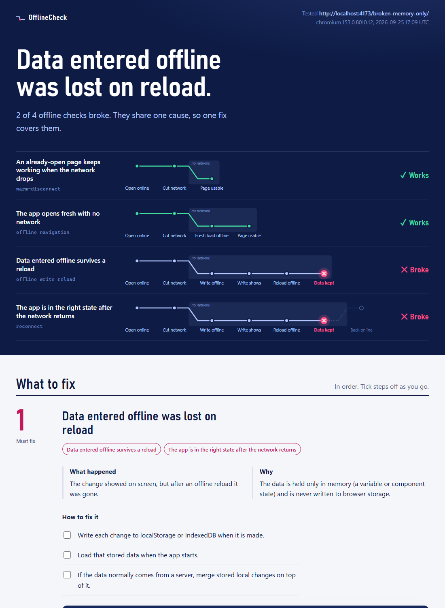

# OfflineCheck: automated offline testing for PWAs and web apps

Test that your web app still opens, accepts changes and keeps user data with no network. OfflineCheck runs offline scenarios in [Playwright](https://playwright.dev/), then writes an HTML report that explains what broke and how to fix it, plus a `fix-plan.md` a coding agent can follow.

Checking offline support by hand means ticking "Offline" in DevTools and reloading. OfflineCheck turns that into a repeatable test for CI. It covers four scenarios:

- **An open page keeps working** when the network drops.
- **A fresh load works offline**, and the report says whether a service worker served it.
- **Data entered offline survives a reload.**
- **The app ends in the right state** when the network returns.

It is a thin layer on Playwright Test. You say what "ready" and "saved" mean in your app; OfflineCheck cuts and restores the network, reloads, and collects the evidence. It is not a storage library, a sync engine or a service worker.

Status: version 0.1, Chromium only, local app URL. Not published to npm yet; install from GitHub (below). npm 12 blocks installs from git unless you pass `--allow-git=all`. Nothing is uploaded anywhere.

## Try the demo

```bash
npm install
npx playwright install chromium
npm run demo          # healthy sample: all four scenarios pass
npm run demo:broken   # notes held only in memory: fails at "persisted-after-reload"
```

Open `offline-check-results/report.html` after a run. It leads with the likely cause, shows how far each check got before it broke, and gives the fix as steps with starting code. A `fix-plan.md` next to it has the same diagnosis for a coding agent. The broken demo produces:



## Quick check, no spec

```bash
npm i -D github:Develifture/offline-check @playwright/test --allow-git=all
npx playwright install chromium
npx offline-check url http://localhost:3000/
```

This runs the two scenarios that need no knowledge of your app: the open page keeps working offline, and the app loads fresh offline. It prints one line per scenario and exits nonzero on failure. To check that your data survives a reload and a reconnect, write a spec (below).

## Use it on your app

```bash
npm i -D github:Develifture/offline-check @playwright/test --allow-git=all
npx offline-check init          # writes one editable offline-check.spec.ts
```

Edit the URL and selectors, then add the reporter (and your `webServer`, or start the app yourself) to `playwright.config.ts`:

```ts
export default defineConfig({
  reporter: [['list'], ['offline-check/reporter']],
  webServer: { command: 'npm run dev', url: 'http://localhost:3000' },
});
```

```bash
npx playwright test offline-check.spec.ts
```

A real-app example (a notes app):

```ts
import { test, expect } from '@playwright/test';
import { offlineChecks } from 'offline-check';

const spec = {
  url: 'http://localhost:3000/',
  ready: async (page) => { await expect(page.locator('#app[data-ready]')).toBeAttached(); },
  view: async (page) => { await expect(page.locator('#new-note')).toBeVisible(); },
  write: {
    action: async (page, token) => { await page.fill('#new-note', token); await page.click('#add-note'); },
    assert: async (page, token) => { await expect(page.getByText(token)).toBeVisible(); },
  },
  reconnect: {
    assert: async (page, token) => { await expect(page.getByText(token)).toBeVisible(); },
  },
};

// Register from your own file: Playwright ties tests to the file that calls test().
for (const c of offlineChecks(spec)) test(c.name, c.run);
```

`token` is a unique value per run, so tests do not depend on order or old data. `ready` must resolve only when your app is really usable (for a service worker app: after the worker is active and cached). Do not use fixed sleeps.

## Scenarios

Each scenario starts from a clean browser context. Service workers are never blocked.

| Scenario | What it does | What it proves |
| --- | --- | --- |
| `warm-disconnect` | Open online, wait for `ready`, go offline, run `view` | The already-open page stays usable. Says nothing about fresh loads. |
| `offline-navigation` | As above, then navigate again while offline | A fresh offline load works. The report says whether a **service worker** controlled it. With none, the page may have come from the HTTP cache, which is a weaker claim. Set `requireServiceWorker: true` to fail in that case. |
| `offline-write-reload` | Offline: run `write.action`, `write.assert`, reload, `write.assert` again | Your data survives a reload while still offline. |
| `reconnect` | As above, then restore the network and run `reconnect.assert` | The app reaches your declared final state. It does **not** prove server sync unless your assertion checks the server. |

Results are `passed`, `failed`, `skipped`, or `unverified`. A scenario you did not configure (no `write`, no `reconnect`) is `unverified`, never `passed`, and makes the run exit nonzero (reporter option `allowUnverified: true` permits it). Each run confirms the cut with `navigator.onLine` and confirms the network is back before the reconnect assertion. Each result lists what was exercised and the phase where it failed.

## Reports

`offline-check-results/` gets three files:

- `results.json` (schema version 1): the raw results.
- `report.html`: one self-contained page, screenshots embedded. For each failure it gives what happened, the likely cause, fix steps, starting code and the evidence. Scenarios that failed for the same reason share one fix.
- `fix-plan.md`: the same diagnosis for a coding agent, with rules (fix the app, not the test), checklists, evidence and the command to re-run.

The reporter deletes only files it wrote, so you can point `outputDir` at a folder that has other files.

A diagnosis is the likely cause, inferred from the phase that broke and the evidence collected there. Confirm it before changing code. One line per scenario prints in the terminal. Playwright exits nonzero if any scenario fails or is unverified. With retries, only the last attempt of each scenario is reported. A run that executes no scenarios leaves earlier results untouched. Result fields are documented in `docs/results.schema.json`.

Each result has: `scenario`, `status`, `phase`, `exercised[]`, `reason?`, `url`, `browser`, `error?`, `consoleErrors[]`, `pageErrors[]`, `failedRequests[]`, `screenshot?`, `project`, `retry`, `file`.

Privacy defaults:

- URLs (fields and inside error text) are reduced to origin and path. Query strings, hashes and `user:pass@` are dropped. **Paths are kept**, so a secret in a path (`/reset/TOKEN`) is not removed.
- Errors keep only their first line, capped at 300 characters. The run's token and anything in `secrets: [...]` are replaced with `[redacted]` (case-insensitive, also URL-encoded). `Bearer …`, `password=…`, `token=…`-style pairs and home-directory paths are scrubbed.
- **Text your app writes to the console or throws is not guaranteed clean.** Patterns cannot know your data (for example an email in an error message). Put your own sensitive values in `secrets`.
- Page text, storage contents, and request bodies are not captured.
- The failure **screenshot** masks the run token and all form fields, plus `maskSelectors: [...]`. It is still a picture of your page and may show other data. Treat it like any other CI artifact and keep it short-lived.
- `OFFLINE_CHECK_DEBUG=1` or `true` (or `debug: true`) captures unredacted errors. It prints a warning. Do not upload those artifacts.

Add `offline-check-results/`, `test-results/`, and any Playwright auth state files to `.gitignore`.

## How it compares

| Option | What it gives you | Where OfflineCheck differs |
| --- | --- | --- |
| DevTools "Offline" checkbox | A quick manual look at one page | Repeatable in CI, covers reload and reconnect, keeps evidence |
| Playwright `context.setOffline()` or the `offline` option | The network switch itself | OfflineCheck is built on it and adds the scenarios, phase tracking, diagnosis and reports |
| Lighthouse | Performance, accessibility and SEO audits. Its PWA category was removed in v12 ([GoogleChrome/lighthouse#15535](https://github.com/GoogleChrome/lighthouse/issues/15535)) | Tests your app's own behaviour offline: your selectors, your data |
| Workbox | A library for writing service workers and caching strategies | Complementary: Workbox builds offline support, OfflineCheck tests that it works |

OfflineCheck does not replace unit tests for your storage code, and it does not test on real devices.

## FAQ

**How do I test that a PWA works offline with Playwright?**
Install OfflineCheck, run `npx offline-check init`, set your URL and selectors, and run `npx playwright test offline-check.spec.ts`. For a first look without a spec, run `npx offline-check url <your-url>`.

**How do I know my service worker served the offline load, and not the browser cache?**
The `offline-navigation` result records whether a service worker controlled the load. Set `requireServiceWorker: true` to fail when it did not.

**How do I test that data survives a reload while offline?**
Define `write.action` and `write.assert` in the spec. The `offline-write-reload` scenario writes while offline, reloads while still offline, and checks again.

**Can a coding agent fix the failures?**
Each run writes `fix-plan.md` with the likely cause, steps, starting code, evidence and the command that proves the fix. The plan tells the agent to fix the app, not weaken the test.

**Does it work in CI?**
Yes. Playwright exits nonzero when a scenario fails or is not checked. See [CI](#ci).

## Limits

- An offline simulation is evidence about the tested browser and app state. It is not a guarantee for every device, browser, storage-pressure condition, or production deployment.
- Chromium only. Firefox, WebKit, persistent-profile restart, upgrade/migration, export/restore, offline queues, and quota tests are not in version 0.1.
- `context.setOffline` cuts the browser's network. Apps that detect offline through their own probes may behave differently on real devices.
- A missing service worker is a result, not a failure by itself. The `offline-navigation` outcome decides the claim.

## CI

`.github/workflows/ci.yml` runs typecheck, build, the sample tests (three times, to catch flakiness), and the package smoke test (`npm run smoke`, which installs the packed tarball into a clean project) on Ubuntu and Windows. On failure it uploads `offline-check-results/` for 3 days. That folder holds masked screenshots, not Playwright's raw `test-results/`. Copy the `npm ci`, `playwright install`, and `npx playwright test` steps into your own workflow.

## Develop

```bash
npm test         # builds, then: healthy sample passes 4 scenarios; each broken sample fails at its expected phase with the expected diagnosis
npm run typecheck
npm run build
npm run smoke    # pack, install into a clean project, run the quick start
npm run demo:calculator   # real-app example; needs Develifture/scientific-calculator checked out next to this repo
```

Samples live in `samples/` (`healthy`, `broken-no-shell`, `broken-http-cache`, `broken-memory-only`, `broken-reconnect`) and need no credentials.

MIT licensed.
